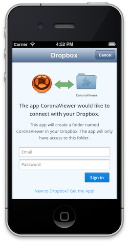

# CoronaViewer (for CoronaCards)

CoronaViewer lets you edit the contents of a `CoronaView` instance and preview those code changes in __real-time__ on your __device__. 

In this workflow, your native app does not have to be recompiled/relinked/reinstalled onto the device. You can edit your Lua code from your desktop editor/IDE and your Corona-related project files will automatically sync and update in the corresponding `CoronaView` in your native app. (This also works with apps you build in the Xcode Simulator.)

NOTE: [Corona SDK/Enterprise](http://coronalabs.com/products/corona-sdk/) developers should go [here](https://github.com/coronalabs/CoronaViewer).

## Project setup

## Code Integration

There are several simple steps:

1. Add `CoronaViewer.framework` to your Xcode project.
2. Use `CoronaViewerController` instead of `CoronaViewController` (note the 'er' in 'Viewer'). It's a drop-in replacement.
3. Disable your call to the `run` or `runWithPath:parameters:` selector of your `CoronaView` instance.
4. Instead, you run via the controller. Specifically, call `CoronaViewerController`'s `run` selector.
5. Ensure that launch url's are handled correctly by adding the following to your implementation of the  `UIApplicationDelegate`:

    ```
    - (BOOL)application:(UIApplication *)app openURL:(NSURL *)url sourceApplication:(NSString *)source annotation:(id)annotation
    {
    	return [CoronaViewerController handleOpenURL:url];
    }
    ```
6. Modify your `Info.plist` so that Dropbox can interact with CoronaViewer properly:

    ```
    <key>CFBundleURLTypes</key>
    <array>
    	<dict>
    		<key>CFBundleURLSchemes</key>
    		<array>
    			<string>db-l1q0pln8qsi8qyp</string>
    		</array>
    	</dict>
    </array>
    ```


### Dropbox

CoronaViewer requires a [Dropbox](https://db.tt/uQgIqtPN) account. You'll need to install the Dropbox plugin on your desktop computer.

### Where Files Go

Your Corona project files (e.g. `main.lua`) should go in the following location in order to be shared:

	${DROPBOX_FOLDER}/Apps/CoronaViewer

NOTE: Only files in this location will be synchronized with your device. The rest of your Dropbox folder is __not__ visible to CoronaViewer.

### Running on device

Build the Corona project in this repo and install it on your device. ([Corona Enterprise](http://coronalabs.com/products/enterprise/) users, see below for additional info.)

You'll be prompted with Dropbox's standard login interface:



This enables the app to synchronize with your Corona project files (i.e. files that are in the above location.)

#### Xcode Simulator

You can also build this app for the Xcode Simulator instead of for your device.


## Availability

### Supported Platforms

* iOS
* Android (TBD)

### Product Tiers

CoronaViewer is available to the following subscriptions/tiers:

* __Corona SDK (Pro)__ uses a slightly different workflow. [Learn more](https://github.com/coronalabs/CoronaViewer)
* __Corona Enterprise__ uses a slightly different workflow. [Learn more](https://github.com/coronalabs/CoronaViewer)
* __CoronaCards__
